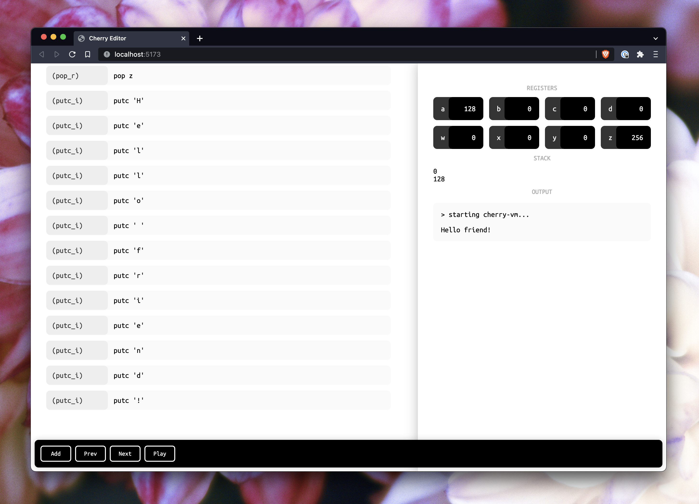

# Cherry

A simple, visual, assembly environment. Learn how assembly can be beautiful
by seeing what's possible with a little guidance (and time travel)!

```sh
npm run dev
```



## Features

-   [x] Bi-directional execution
-   [x] Eight general purpose 32-bit registers
-   [x] Data stack w/ manipulation instructions (`push` and `pop`)
-   [~] Interactive structured editor
-   [ ] Procedure definitions
-   [ ] Conditional instructions

I didn't quite have the time/energy to get to control flow, or to finish
up the actual editing bits of the editor, but hopefully you can kinda see
where I was going with it. :^)
