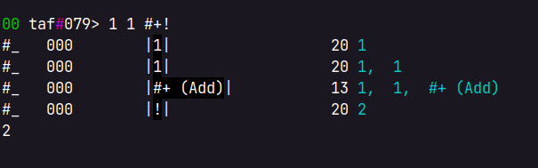

## tafr is a stack based machine
([webbed site](https://ckie.dev/taf))

tafr has 3 stacks:

- a program stack (containing `Tok`s to be evaluated)
- a pc stack (to allow for calls)
- a data stack (for the programs)

## tafr is optimized for taf, the assembly language and instruction set

the assembly is parsed into `Tok`s:

```rust
cargo run repl
00 taf#050> :p "helo world!" #print!
[
    String(
        "helo world!",
    ),
    Ptr(
        "print",
    ),
    Call,
]
```

```
FUNC PC         INSTRUCTION             DATA STACK
#_   000        |"helo world!"|       8 "helo world!"
#_   000        |#print       |       7 "helo world!",  #print (Print)
helo world! ; printed while ! is being evaluated..
#_   000        |!|                  20
            ; it's done being evaluated, now the data stack is empty
```

## tafr is small

taf is feasible to implement using hardware.

### supported `Tok`s

| name     | symbol | description                                               |
| :------- | :----- | :-------------------------------------------------------- |
| `Point`  | `@hi`  | point to the code ahead                                   |
| `End`    | `~`    | either end a `@`point or return from a call               |
| `Ptr`    | `#hi`  | point to a previously-registed point                      |
| `Call`   | `!`    | pop a `#Ptr` and jump to it                               |
| `String` | `"hi"` | literal                                                   |
| `int`    | 1337   | literal                                                   |
| `<atom>` | `hi`   | an integer in the assembled form and a string unassembled |

### builtin functions

| ptr      | input              | effect                   | output           |
|:---------|:-------------------|:-------------------------|:-----------------|
| `#print` | $(x)$              | print x                  | $()$             |
| `#+`     | $(x,y)$            | $y = y + x$              | $(y)$            |
| `#-`     | $(x,y)$            | $y = y - x$              | $(y)$            |
| `#dupn`  | $(x,n)$            | duplicate $x$ $n$ times  | $(... x)$        |
| `#.`     | $(data_i ... x,i)$ | swap $x$ with $data_i$   | $(x ... data_i)$ |
| `#>`     | $(x,y)$            | if $x>y$ skip two `Tok`s | $()$             |

## (future, if any)

- implement taf with logic gates (i.e. [Logisim](http://www.cburch.com/logisim/))
- more builtins (conditionals! ffi!)

## (inspiration)

- [wiki.xxiivv.com](https://wiki.xxiivv.com) for the writing style
- forth (though I didn't ever understand forth code before writing this)

## (sample code)

#### fib
<details>
<summary></summary>

``` 
00 taf#063> @fib #dup! 2 #.! 1 #.! #+! ~
    #_   000        |@fib|               17
    ————————>       |#dup (User(7))|0
    ————————>       |!|  3
    ————————>       |2|  3
    ————————>       |#. (Spot)|0
    ————————>       |!|  3
    ————————>       |1|  3
    ————————>       |#. (Spot)|0
    ————————>       |!|  3
    ————————>       |#+ (Add)|0
    ————————>       |!|  3
————————>       |End|1
 
00 taf#075> 0 1 #fib!
#_   000        |0|                  20 0
#_   000        |1|                  20 0,  1
#_   000        |#fib (User(64))|     6 0,  1,  #fib (User(64))
    #_   000        |!|                  20 0,  1
    #fib 079        |#dup (User(7))|      7 0,  1,  #dup (User(7))
    #dup 066        |End|                18 0,  1,  1
    #fib 079        |2|                  20 0,  1,  1,  2
    #fib 079        |#. (Spot)|          12 0,  1,  1,  2,  #. (Spot)
    #fib 079        |!|                  20 1,  1,  0
    #fib 079        |1|                  20 1,  1,  0,  1
    #fib 079        |#. (Spot)|          12 1,  1,  0,  1,  #. (Spot)
    #fib 079        |!|                  20 1,  0,  1
    #fib 079        |#+ (Add)|           13 1,  0,  1,  #+ (Add)
    #fib 079        |!|                  20 1,  1
#fib 079        |End|                18 1,  1
1
1
```

</details>
### 1 + 1
<details>
<summary></summary>

```
00 taf#079> 1 1 #+!
#_   000        |1|                  20 1
#_   000        |1|                  20 1,  1
#_   000        |#+ (Add)|           13 1,  1,  #+ (Add)
#_   000        |!|                  20 2
2
```

</details>

### 1 > 2
<details>
<summary></summary>

```
00 taf#107> @yes"true"#print!~ 1 2 #>! #yes!
    #_   000        |@yes|               17
    ————————>       |"true"|0
    ————————>       |#print (Print)|0
    ————————>       |!|  3
————————>       |End|1
#_   000        |1|                  20 1
#_   000        |2|                  20 1,  2
#_   000        |#> (Gt)|            14 1,  2,  #> (Gt)
#_   000        |!|                  20
#_   000        |#yes (User(108))|    5 #yes (User(108))
    #_   000        |!|                  20
    #yes 118        |"true"|             15 "true"
    #yes 118        |#print (Print)|      7 "true",     #print (Print)
true
    #yes 118        |!|                  20
#yes 118        |End|                18
```

</details>

### *
```
00 taf#035> @multr 2#.!#dup!2#.!#+! 1#.!1#-!1   1 1#.!#dup! #>! #multr! 1#.! ~ 5 3 0 #multr!
[try it out yourself, maybe change max_depth in machine.rs to a small number]
```
Recursively multiplies (until it runs out of stack, since `>` is incomplete and conditionals need to be handled better)
