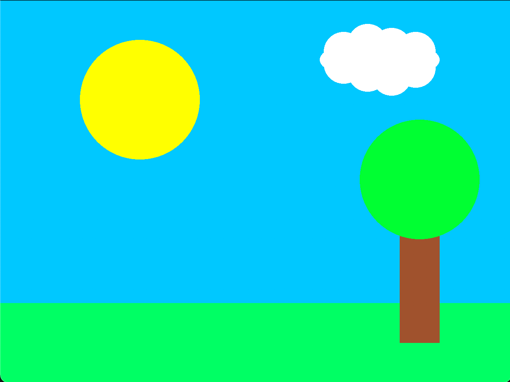

# Tux
Tux is an assembly language that makes beautiful images :)

## Basic Idea
The basic idea of tux is that instead of the usual 
assembly instructions there are a bunch of instructions 
that let you draw different shapes such as rectangles, 
lines, ellipses and polygons. In addition to drawing
instructions there are a few more typical assembly
instructions such as basic arithmetic, branching and
storing and loading registers.

## Example Image

## Instructions
| Mnemonic | Description |
| -------- | ----------- |
| `move`   | Move pen relative to current pen position.
| `store`  | Store a value in a register.
| `add`    | Store the sum of 2 values in a register.
| `sub`    | Store the difference of 2 values in a register.
| `mul`    | Store the product of 2 values in a register.
| `div`    | Store the quotient of 2 values in a register.
| `stbg`   | Set the background color of the image.
| `stps`   | Set the pen position.
| `stcl`   | Set the pen color.
| `strd`   | Set line radius.
| `cmp`    | Compare 2 values.
| `jmp`    | Unconditional jump.
| `jeq`    | Jump if result of `cmp` is 0.
| `jne`    | Jump if result of `cmp` isn't 0.
| `jlt`    | Jump if result of `cmp` is -1.
| `jgt`    | Jump if result of `cmp` is 1.
| `jle`    | Jump if result of `cmp` isn't 1.
| `jge`    | Jump if result of `cmp` isn't -1.
| `rect`   | Draw rectangle of a given width and height.
| `line`   | Draw a line of a given gradient.
| `elps`   | Draw an ellipse of a given width and height.
| `vert`   | Add a vertex to the polygon.
| `pgon`   | Draw the polygon and clear vertices.
